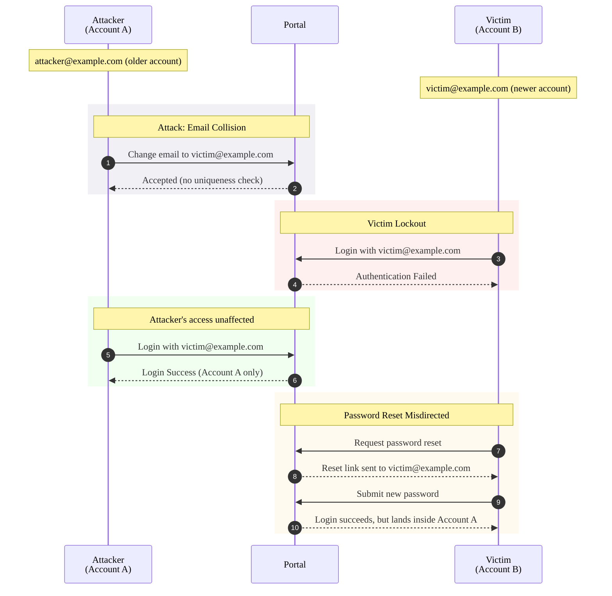

Account lockout does not always require brute force or stolen credentials. A missing uniqueness check on the email update endpoint is enough. This is what I found in a cloud portal.

## Background

While managing my own accounts on a cloud data portal associated with a consumer electronics device, I noticed that the email change functionality accepted any email address without validation. Email changes went through a `PUT /portal/user` request. To test boundary conditions, I tried changing my email to the address of a second personal test account.

It responded with HTTP 200:

```json
{
  "status": "OK",
  "user": {
    "email": "victim@example.com"
  }
}
```

The vulnerability exists because the email update flow fails to check whether the new email address is already registered, despite the same validation being enforced during account creation.

## How It Works

Two conditions make this exploitable: the attacker must know the target's email address, and their account must predate the target's. The system resolves email collisions by creation order, so the older account always wins.

1. **Setup**: Account A (attacker, older): `attacker@example.com`. Account B (victim, newer): `victim@example.com`.
2. **Collision**: The attacker changes Account A's email to `victim@example.com` via the standard update endpoint. It goes through without error, and the system sends an email change notification to `victim@example.com`. The victim receives it but has no context for it and will likely ignore or dismiss it as spam.
3. **Lockout**: On login, `victim@example.com` resolves to Account A (the older record), so the victim's password doesn't match and authentication fails. Account B's data stays untouched; the attacker can only access their own Account A.

Password reset doesn't help by default. Requesting a reset for `victim@example.com` again resolves to Account A, so the link arrives in the victim's inbox (they own that address). They click it, set a new password, log in, and land inside Account A. No error appears; the only symptom is that their cloud data seems to have changed.

**Recovery**: If the victim pieces together what happened, they can change Account A's email to something else while in that session, which frees `victim@example.com` and makes Account B reachable again.



## Impact

- **Account lockout**: The victim can't log in until the collision is resolved.
- **Silent misdirection**: Password reset completes without errors but lands the victim inside Account A. Their cloud data appears to have changed; nothing signals they're in the wrong account.

An endpoint that accepts email changes without checking for conflicts undoes whatever validation the registration flow enforces. I reported the finding through a third-party intermediary, who confirmed it was fixed.
