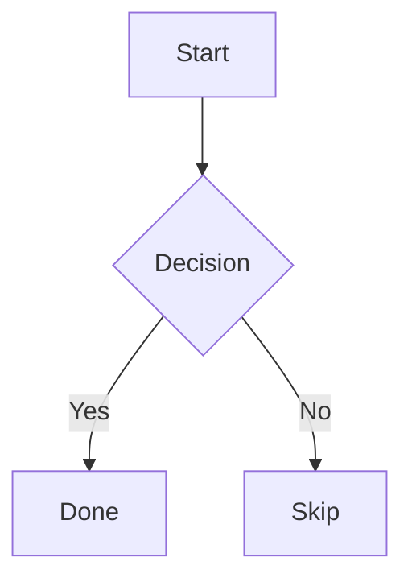
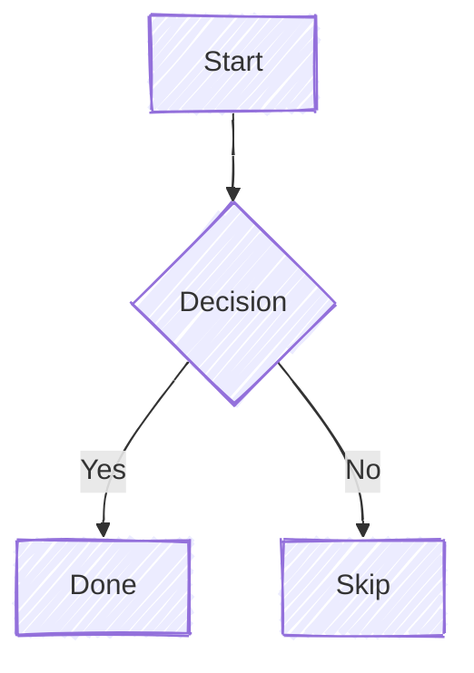
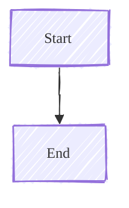

# Writing Posts

A reference for writing posts and pages in this Jekyll theme.

## Front Matter Reference

Every post in `_posts/` supports these front matter fields:

```yaml
---
layout: post
title: 'Post Title'
description: '160-character description, used as SEO meta, post card preview, and social share.'
tldr: 'One-sentence summary shown in a TL;DR box at the top of the post.'
date: 2025-01-15 12:00:00 +0000
image: /images/posts/my-post.jpg

topic: programming
tags: [javascript, tooling]
keywords: [webpack, vite]

author:
  - john-doe

featured: false
video: false
gallery: false
download_url: 'https://example.com/gallery/my-album'
image_zoom: ''

math: false
mermaid: false

robots: 'noindex'
last_modified_at: 2025-02-01

short_url: 'my-post'

comments: true
share: true

series: 'Series Name'
series_order: 1

lang: 'en'

translations:
  - '[[2025-01-15-it-slug]]'

cited_by:
  - '[Article Title - Site Name](https://example.com/article)'

discussions:
  - 'https://news.ycombinator.com/item?id=XXXXXXXX'
  - 'https://reddit.com/r/topic/comments/xxxxx/post_title'
---
```

The `date` field follows Jekyll front matter format: `YYYY-MM-DD HH:MM:SS +/-HHMM`. See [jekyllrb.com/docs/front-matter](https://jekyllrb.com/docs/front-matter/).

## Taxonomy

The theme uses three distinct taxonomy fields.

### topic

```yaml
topic: linux
```

- Single value only.
- Drives the `/topics/` page and all homepage topic widgets.
- Displayed as the category pill on post cards and in the post hero.
- Used as the primary signal for related-post matching.

### tags

```yaml
tags: [linux, ubuntu, terminal]
```

- Multiple values allowed.
- Drives the `/tags/` filtering page.
- Displayed in the post footer.
- Keep tags lowercase.

### keywords

```yaml
keywords: [arch linux, pacman, AUR]
```

- Never displayed in the UI.
- Emitted as `<meta name="keywords">` and included in the search index.
- Use for terms more specific than your tags: product names, acronyms, jargon.

### description

```yaml
description: 'A practical guide to setting up Arch Linux from scratch.'
```

- Used as: SEO meta description, Open Graph, Twitter Card, post card text, search snippet.
- Aim for 120-160 characters.

## Authors

When `author` is not set, the post defaults to the primary author defined in `_config.yml`. No front matter is needed for single-author posts by the site owner.

The `author` field is a list (Obsidian **List** property type). Use it even for a single author:

```yaml
author:
  - edoardo-tosin
  - john-doe
```

One entry renders a plain author card. Multiple entries render an "About the Authors" card group. The primary author slug (`site.author.slug`) resolves from `_config.yml`; all other slugs must have an entry in `_data/authors.yml`.

The resolved names are also emitted in `<meta name="author">` and the Schema.org JSON-LD for the post.

## Gallery Posts

Mark a post as a gallery entry by setting `gallery: true`. Gallery posts appear in the `/gallery/` page and in the homepage gallery section.

```yaml
gallery: true
```

### download_url

```yaml
download_url: 'https://example.com/gallery/my-album'
```

- Optional. When set, a **Download Photo** button is shown at the top of the post and a **Download** icon appears in the gallery card info strip.
- Use this to link to a page where visitors can download or license the full-resolution original (e.g. a hosting album or portfolio page).
- Must be a full URL (`https://`). An empty string or omitted field hides both buttons.

### image_zoom

```yaml
image_zoom: 'https://example.com/photos/my-photo-hq.jpg'
```

- Optional. When set, clicking the gallery card thumbnail opens this URL in the fullscreen image viewer instead of the card's `image`.
- Use this to serve a higher-resolution file in the viewer while keeping a compressed image as the card thumbnail.
- Must be a full URL (`https://`). Omit the field to fall back to the `image` URL in the viewer.

## Callout Blocks

Callouts render from pure Markdown using GitHub-style blockquote syntax.

```markdown
> [!NOTE]
> This is a note.

> [!TIP]
> A helpful suggestion.

> [!IMPORTANT]
> Critical information.

> [!WARNING]
> Something that could cause problems.

> [!CAUTION]
> A dangerous or destructive action.

> [!SPOILER]
> Content revealed on click - hidden by default.
```

Both inline and multi-paragraph variants work:

```markdown
> [!NOTE]
> Single paragraph on the next line.

> [!WARNING]
>
> Multiple paragraphs - blank `>` line between them.
>
> Second paragraph continues here.
```

**Visual hierarchy:**

| Type        | Color           | Intent                                                       |
| ----------- | --------------- | ------------------------------------------------------------ |
| `NOTE`      | Neutral / slate | Informational                                                |
| `TIP`       | Green           | Helpful suggestion                                           |
| `IMPORTANT` | Purple          | Must-read information                                        |
| `WARNING`   | Orange          | Potential issue                                              |
| `CAUTION`   | Red             | Dangerous or irreversible action                             |
| `SPOILER`   | Muted / neutral | Click-to-reveal collapsible; content always visible in print |

`SPOILER` renders as a native `<details>` element with an eye icon and a rotating chevron. No JavaScript is required. On GitHub, `[!SPOILER]` degrades to a plain blockquote. In Obsidian it renders as a collapsible callout.

## Defanged Indicators

Write defanged URLs, IPs, and domains directly in the post body. The build
detects recognised patterns and wraps them in an amber monospaced style,
visually separating them from regular links and text.

| Notation                   | Example                                       |
| -------------------------- | --------------------------------------------- |
| Defanged HTTP/HTTPS scheme | `hXXp://evil.com`, `hxxps[://]c2.example.net` |
| Defanged domain (`[.]`)    | `evil[.]com`, `cdn[.]malware[.]io`            |
| Defanged domain (`[dot]`)  | `evil[dot]com`, `cdn[dot]badactor[dot]ru`     |
| Defanged domain (`(.)`)    | `evil(.)com`, `cdn(.)malware(.)io`            |
| Defanged domain (`(dot)`)  | `evil(dot)com`, `cdn(dot)badactor(dot)ru`     |
| Defanged IPv4              | `192.168[.]1.1`, `10[.]0[.]0[.]254`           |
| Mixed scheme and IP        | `hXXp://192.168[.]1.1/shell.elf`              |

Defanging is applied to the post body only. The post header (title, date, and
other metadata) is never processed.

The following contexts are left untouched:

- Fenced and indented code blocks
- Inline `` `code` `` spans
- Hyperlink text and targets

Write the notation as plain text in prose; no special markup is required:

```markdown
The implant beaconed to hXXps://c2[.]attacker[.]net/check-in
and fetched a second stage from 203.0[.]113.42/payload.bin.
```

In Obsidian and on GitHub the notation renders as plain text. On the built site
and in the RSS feed, each matched token is wrapped in an amber span.

## Supported Markdown

| Element         | Syntax                   | Notes                                                                          |
| --------------- | ------------------------ | ------------------------------------------------------------------------------ |
| Headings        | `## H2`, `### H3`        | H1 is the post title - do not repeat it                                        |
| Bold / Italic   | `**bold**`, `*italic*`   |                                                                                |
| Inline code     | `` `code` ``             | Highlighted with accent color                                                  |
| Code block      | ` ```javascript `        | Always include language tag                                                    |
| Blockquote      | `> text`                 | Standard blockquotes are untouched                                             |
| Link            | `[text](url)`            |                                                                                |
| Image           | ``            | Auto-zoom on click, lazy-loaded                                                |
| Table           | `\| col \| col \|`       | Scrollable on small screens                                                    |
| Task list       | `- [ ] item`             | GFM checklist                                                                  |
| Footnote        | `text[^1]` `[^1]: note`  | Rendered at bottom; hover or focus the reference for an inline preview tooltip |
| `<kbd>`         | `<kbd>Ctrl</kbd>`        | Keyboard shortcut styling                                                      |
| `<mark>`        | `<mark>text</mark>`      | Accent highlight                                                               |
| Math (inline)   | `$E = mc^2$`             | Requires `math: true`                                                          |
| Math (block)    | `$$\nabla \cdot E = 0$$` | Requires `math: true`                                                          |
| Diagram         | ` ```mermaid `           | Requires `mermaid: true`                                                       |
| Details/summary | `<details><summary>`     | Native HTML collapsible                                                        |

## Code Blocks

Always declare a language:

````markdown
```javascript
const msg = 'Hello, world!';
console.log(msg);
```
````

Supported language aliases: `js`, `ts`, `py`, `rb`, `sh`/`bash`, `yml`/`yaml`, `html`, `css`, `scss`, `json`, `sql`, `go`, `rust`, `cpp`, `java`.

## Images

Place post images in `images/posts/`. Reference with a relative path:

```markdown

```

Images are lazy-loaded and zoom on click. Always provide alt text.

The post hero image is set in front matter (`image:`), not inline Markdown.

## Math (KaTeX)

Enable KaTeX on a per-post basis:

```yaml
math: true
```

Then use standard LaTeX delimiters:

```markdown
Inline: $E = mc^2$

Display:

$$
\int_0^\infty e^{-x^2} dx = \frac{\sqrt{\pi}}{2}
$$
```

## Diagrams (Mermaid)

Enable Mermaid on a per-post basis:

```yaml
mermaid: true
```

Then use a fenced code block with the `mermaid` language tag:

````markdown

````

Diagrams adapt to the site's dark/light theme automatically. Mermaid is loaded only on posts that enable it.

### Hand-drawn style

Flowchart and graph diagrams support a hand-drawn style via the `%%{init}%%` directive. Add it as the first line inside the code block:

````markdown

````

If the block already has an `%%{init}%%` directive, add `'look': 'handDrawn'` inside the existing object rather than adding a second directive:

````markdown

````

This style is only implemented for `flowchart` and `graph` diagram types. Sequence diagrams and other types ignore the `look` setting.

## Series Navigation

Link related posts into an ordered series:

```yaml
series: 'Linux Mastery'
series_order: 2
```

Posts with a matching `series` value are sorted by `series_order` and collected into a widget that appears at the top of each post. The widget shows the series name, a numbered list of all parts (current post marked, others linked), and a progress indicator ("Part 2 of 4"). The widget is hidden when fewer than two posts share the same series name, and it is preserved in print/PDF with simplified styling.

## Multilingual Posts

Set `lang` to the BCP 47 language code of the post. If omitted, the post inherits the site default from `_config.yml`.

```yaml
lang: 'it'
```

To link a post to its translations, use the `translations` list. Each entry is an Obsidian wikilink `[[filename]]` pointing to the companion post file (without the `.md` extension). The date prefix must be included because that is how Obsidian generates filenames.

```yaml
translations:
  - '[[2025-01-15-my-post-de]]'
  - '[[2025-01-15-my-post-it]]'
```

You can also supply an optional display title after a pipe, which overrides the post's own title in the translation notice:

```yaml
translations:
  - '[[2025-01-15-my-post-it|Versione italiana]]'
```

At build time Jekyll resolves each wikilink to the actual post: it first tries to match the date-stripped slug (`my-post-it`), then falls back to a full filename match (`2025-01-15-my-post-it`). The post's own `lang` field is used for the `hreflang` and `lang` attributes - no need to repeat the language code.

When `translations` is set, a notice appears at the top of the post listing the available languages as links. The notice label (e.g. "Also available in") is rendered in the target language from `_data/i18n.yml`. All other page UI remains in English.

The companion post should include a matching `translations` entry pointing back to this post.

## Cross-references

### backlinks (automatic)

When a post contains a `[[wikilink]]` pointing to another post, that target post automatically shows a "Referenced in" section listing all posts that link to it. No front matter is needed because the plugin scans content at build time.

To create a backlink from post A to post B, add a wikilink anywhere in post A's content:

```markdown
[[post-b-slug]] or [[Post B Title]]
```

Post B will then show post A in its "Referenced in" section.

### discussions

Link to external threads where the post has been shared and discussed. Renders as an inline "Join the discussion on" line below the post body. Omit the field when there are no external threads.

Each entry is a plain URL string. The platform icon and label are detected automatically from the URL domain and path.

```yaml
discussions:
  - 'https://news.ycombinator.com/item?id=XXXXXXXX'
  - 'https://reddit.com/r/linux/comments/xxxxx/post_title'
  - 'https://lobste.rs/s/xxxxx/post_title'
  - 'https://fosstodon.org/@user/109876543210'
  - 'https://bsky.app/profile/user.bsky.social/post/xxxxx'
  - 'https://dev.to/user/post-title'
```

**Platform detection** (matched from the URL):

| URL pattern                       | Icon          | Brand color | Label                     |
| --------------------------------- | ------------- | ----------- | ------------------------- |
| domain contains `ycombinator.com` | Hacker News   | #ff6600     | "Hacker News"             |
| domain contains `reddit.com`      | Reddit        | #ff4500     | "r/subreddit" or "Reddit" |
| domain contains `lobste.rs`       | Lobsters      | #ac130d     | "Lobsters"                |
| URL path contains `/@`            | Mastodon      | #6364ff     | "Mastodon"                |
| domain contains `bsky.app`        | Bluesky       | #0085ff     | "Bluesky"                 |
| domain contains `dev.to`          | DEV Community | #0a0a0a     | "DEV Community"           |
| domain contains `twitter.com`     | Twitter       | #1da1f2     | "Twitter"                 |
| domain is `x.com`                 | X             | #000000     | "X"                       |
| domain contains `linkedin.com`    | LinkedIn      | #0a66c2     | "LinkedIn"                |
| domain contains `github.com`      | GitHub        | #181717     | "GitHub"                  |
| domain contains `matrix.to`       | Matrix        | #000000     | "Matrix"                  |
| _(anything else)_                 | speech bubble | neutral     | domain name               |

For Reddit, if the URL path contains `/r/subreddit`, the label is automatically extracted as `r/subreddit`.

For Mastodon, any instance domain is supported as long as the post URL contains `/@` (e.g. `/@user/postid`).

**Rules:**

- Entries without a valid `https://` or `http://` URL are silently skipped.
- The section is not rendered when `discussions` is absent or every entry is invalid.
- The section is hidden in print/PDF.

### cited_by

List external pages (articles, blogs, papers, news) that reference the current post. Rendered as a "Cited by" section at the bottom of the post, visible in print/PDF.

```yaml
cited_by:
  - '[Article Title | Site Name](https://example.com/article)'
  - '[Another Reference](https://other.com/post)'
```

**Supported entry formats:**

| Format        | Example                   | Behaviour                        |
| ------------- | ------------------------- | -------------------------------- |
| Markdown link | `'[Title](https://…)'`    | Renders with custom display text |
| Bare URL      | `'https://example.com'`   | Renders with URL as display text |
| Null / empty  | _(omitted or blank line)_ | Silently skipped                 |

**Rules:**

- Each entry **must** be a YAML string inside a list. The field type in Obsidian Properties must be **List**.
- Only `https://` and `http://` URLs are rendered; entries with other schemes (e.g. `javascript:`, `data:`) are silently dropped.
- If every entry in the list is blank or invalid, the "Cited by" section is not rendered at all.
- Title text is HTML-escaped automatically; no manual escaping needed.
- Obsidian always writes list properties as YAML arrays, so single-item lists are safe:
  ```yaml
  cited_by:
    - '[Only one reference](https://example.com)'
  ```

## Wikilinks

Use Obsidian-style `[[wikilink]]` syntax to create internal links without writing full paths:

```markdown
[[my-post]] links to the page with slug or title "my-post"
[[my-post|Display Text]] custom link text
[[my-post#section-heading]] link with anchor
[[my-post#heading|Label]] anchor with custom text
[[#heading]] same-page anchor link
```

**Resolution:** the plugin looks up pages by filename slug first (e.g. `2025-01-15-my-post.md` -> `my-post`), then by front matter `title` (slugified, case-insensitive). The first match wins.

**Broken links** render as `<span class="wikilink-broken">text</span>`, styled with a red dotted underline and `not-allowed` cursor.

Wikilinks inside fenced code blocks and inline `code` are left untouched.

## Content Checks

The theme checks posts at build time. The build fails if a post is missing:

- `title`
- `date`
- `topic`

Warnings are shown for:

- Missing or over-length `description`
- `topic` set to an array (must be a single string)
- Code blocks without a language specifier
- Images with empty or missing alt text
- Non-descriptive link text ("click here", "read more")
- Heading levels that skip (e.g. H2 to H4)
- Duplicate permalink
