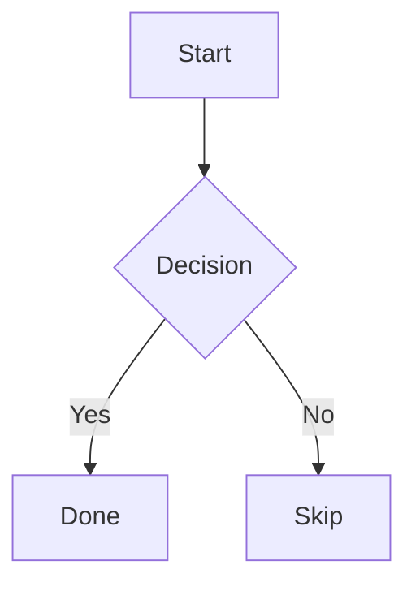

# Writing Posts

A reference for writing posts and pages in this Jekyll theme.

## Front Matter Reference

Every post in `_posts/` supports these front matter fields:

```yaml
---
layout: post
title: 'Post Title'
description: '160-character description, used as SEO meta, post card preview, and social share.'
date: 2025-01-15 12:00:00 +0000
image: /images/posts/my-post.jpg

topic: programming
tags: [javascript, tooling]
keywords: [webpack, vite]

featured: false
video: false
gallery: false

math: false
mermaid: false

robots: 'noindex'
last_modified_at: 2025-02-01

short_url: 'my-post'

comments: true
share: true

cited_by:
  - '[Article Title - Site Name](https://example.com/article)'
---
```

The `date` field follows Jekyll front matter format: `YYYY-MM-DD HH:MM:SS +/-HHMM`. See [jekyllrb.com/docs/front-matter](https://jekyllrb.com/docs/front-matter/).

## Taxonomy

The theme uses three distinct taxonomy fields.

### topic

```yaml
topic: linux
```

- Single value only.
- Drives the `/topics/` page and all homepage topic widgets.
- Displayed as the category pill on post cards and in the post hero.
- Used as the primary signal for related-post matching.

### tags

```yaml
tags: [linux, ubuntu, terminal]
```

- Multiple values allowed.
- Drives the `/tags/` filtering page.
- Displayed in the post footer.
- Keep tags lowercase.

### keywords

```yaml
keywords: [arch linux, pacman, AUR]
```

- Never displayed in the UI.
- Emitted as `<meta name="keywords">` and included in the search index.
- Use for terms more specific than your tags: product names, acronyms, jargon.

### description

```yaml
description: 'A practical guide to setting up Arch Linux from scratch.'
```

- Used as: SEO meta description, Open Graph, Twitter Card, post card text, search snippet.
- Aim for 120-160 characters.

## Callout Blocks

Callouts render from pure Markdown using GitHub-style blockquote syntax.

```markdown
> [!NOTE]
> This is a note.

> [!TIP]
> A helpful suggestion.

> [!IMPORTANT]
> Critical information.

> [!WARNING]
> Something that could cause problems.

> [!CAUTION]
> A dangerous or destructive action.
```

Both inline and multi-paragraph variants work:

```markdown
> [!NOTE]
> Single paragraph on the next line.

> [!WARNING]
>
> Multiple paragraphs - blank `>` line between them.
>
> Second paragraph continues here.
```

**Visual hierarchy:**

| Type        | Color           | Intent                           |
| ----------- | --------------- | -------------------------------- |
| `NOTE`      | Neutral / slate | Informational                    |
| `TIP`       | Green           | Helpful suggestion               |
| `IMPORTANT` | Purple          | Must-read information            |
| `WARNING`   | Orange          | Potential issue                  |
| `CAUTION`   | Red             | Dangerous or irreversible action |

## Supported Markdown

| Element         | Syntax                   | Notes                                   |
| --------------- | ------------------------ | --------------------------------------- |
| Headings        | `## H2`, `### H3`        | H1 is the post title - do not repeat it |
| Bold / Italic   | `**bold**`, `*italic*`   |                                         |
| Inline code     | `` `code` ``             | Highlighted with accent color           |
| Code block      | ` ```javascript `        | Always include language tag             |
| Blockquote      | `> text`                 | Standard blockquotes are untouched      |
| Link            | `[text](url)`            |                                         |
| Image           | ``            | Auto-zoom on click, lazy-loaded         |
| Table           | `\| col \| col \|`       | Scrollable on small screens             |
| Task list       | `- [ ] item`             | GFM checklist                           |
| Footnote        | `text[^1]` `[^1]: note`  | Rendered at bottom of post              |
| `<kbd>`         | `<kbd>Ctrl</kbd>`        | Keyboard shortcut styling               |
| `<mark>`        | `<mark>text</mark>`      | Accent highlight                        |
| Math (inline)   | `$E = mc^2$`             | Requires `math: true`                   |
| Math (block)    | `$$\nabla \cdot E = 0$$` | Requires `math: true`                   |
| Diagram         | ` ```mermaid `           | Requires `mermaid: true`                |
| Details/summary | `<details><summary>`     | Native HTML collapsible                 |

## Code Blocks

Always declare a language:

````markdown
```javascript
const msg = 'Hello, world!';
console.log(msg);
```
````

Supported language aliases: `js`, `ts`, `py`, `rb`, `sh`/`bash`, `yml`/`yaml`, `html`, `css`, `scss`, `json`, `sql`, `go`, `rust`, `cpp`, `java`.

## Images

Place post images in `images/posts/`. Reference with a relative path:

```markdown

```

Images are lazy-loaded and zoom on click. Always provide alt text.

The post hero image is set in front matter (`image:`), not inline Markdown.

## Math (KaTeX)

Enable KaTeX on a per-post basis:

```yaml
math: true
```

Then use standard LaTeX delimiters:

```markdown
Inline: $E = mc^2$

Display:

$$
\int_0^\infty e^{-x^2} dx = \frac{\sqrt{\pi}}{2}
$$
```

## Diagrams (Mermaid)

Enable Mermaid on a per-post basis:

```yaml
mermaid: true
```

Then use a fenced code block with the `mermaid` language tag:

````markdown

````

Diagrams adapt to the site's dark/light theme automatically. Mermaid is loaded from jsDelivr only on posts that enable it.

## Series Navigation

Link related posts into an ordered series:

```yaml
series: 'Linux Mastery'
series_order: 2
```

Posts with matching `series` values are linked with Prev/Next navigation in reading order.

## Cross-references

### backlinks (automatic)

When a post contains a `[[wikilink]]` pointing to another post, that target post automatically shows a "Referenced in" section listing all posts that link to it. No front matter is needed because the plugin scans content at build time.

To create a backlink from post A to post B, add a wikilink anywhere in post A's content:

```markdown
[[post-b-slug]] or [[Post B Title]]
```

Post B will then show post A in its "Referenced in" section.

### cited_by

List external pages (articles, blogs, papers, news) that reference the current post. Rendered as a "Cited by" section at the bottom of the post, visible in print/PDF.

```yaml
cited_by:
  - '[Article Title | Site Name](https://example.com/article)'
```

Each entry is a markdown link string: `[display title](full URL)`. This format is natively supported by Obsidian's Properties panel as a List field.

## Wikilinks

Use Obsidian-style `[[wikilink]]` syntax to create internal links without writing full paths:

```markdown
[[my-post]] links to the page with slug or title "my-post"
[[my-post|Display Text]] custom link text
[[my-post#section-heading]] link with anchor
[[my-post#heading|Label]] anchor with custom text
[[#heading]] same-page anchor link
```

**Resolution:** the plugin looks up pages by filename slug first (e.g. `2025-01-15-my-post.md` -> `my-post`), then by front matter `title` (slugified, case-insensitive). The first match wins.

**Broken links** render as `<span class="wikilink-broken">text</span>`, styled with a red dotted underline and `not-allowed` cursor.

Wikilinks inside fenced code blocks and inline `code` are left untouched.

## Content Checks

The theme checks posts at build time. The build fails if a post is missing:

- `title`
- `date`
- `topic`

Warnings are shown for:

- Missing or over-length `description`
- `topic` set to an array (must be a single string)
- Code blocks without a language specifier
- Images with empty or missing alt text
- Non-descriptive link text ("click here", "read more")
- Heading levels that skip (e.g. H2 to H4)
- Duplicate permalink
